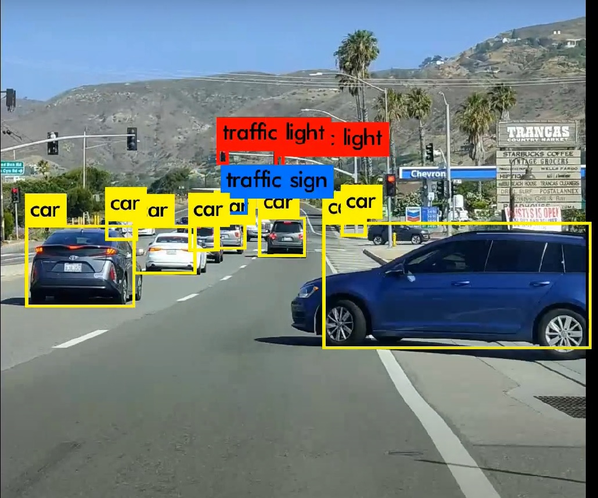

# BDD100K-YOLOV3-tiny (do not clone this branch) 

Road Object detection on BDD100K using Yolov3-tiny trained on Jetson Xavier

 \
**[Link](https://www.youtube.com/watch?v=Asf7Op9gzO4&t=1s) to the video**

## Barkeley DeepDrive Dataset

The largest open driving video dataset with 100K videos and 10 tasks to evaluate the exciting progress of image recognition algorithms on autonomous driving. Each video has 40 seconds and a high resolution. The dataset represents more than 1000 hours of driving experience with more than 100 million frames. The videos comes with GPU/IMU data for trajectory information. The dataset possesses geographic, environmental, and weather diversity, which is useful for training models that are less likely to be surprised by new conditions. The dynamic outdoor scenes and complicated ego-vehicle motion make the perception tasks even more challenging. The tasks on this dataset include image tagging, lane detection, drivable area segmentation, road object detection, semantic segmentation, instance segmentation, multi-object detection tracking, multi-object segmentation tracking, domain adaptation, and imitation learning.

Reference from [BDD100k_Github](https://github.com/ucbdrive/bdd100k)


## Dependencies & Dataset

This repository requires the following dependencies and dataset
- Python3
- [Berkeley DeepDrive Dataset](https://bdd-data.berkeley.edu/) - Download the Images and Labels (Total size bdd100k_images.zip - 6.8 GB)
- [Yolov3](https://github.com/pjreddie/darknet)


## Understanding the Dataset

After being unzipped, all the files will reside in a folder named bdd100k. All the images will reside in bdd100k/images and labels in bdd100k/labels.  The images contains the frame at 10th second in the corresponding video.

- bdd100k/images contains three other folders called train, test and val.
- bdd100k/labels contains two json files based on the label format for training and validation sets.  


## Steps to build

- Download the dataset and unzip the image and labels. Make sure you have \train folder with ~70k images as well as labels with train json file.
- Clone the Yolov3 darknet repository. Configure the Makefile to enable training it on GPU.
  ```
  git clone https://github.com/pjreddie/darknet.git
  cd darknet
  make
  ```
- Convert the labels into a .txt format where each txt file contains label information of each image. The python script ```label_to_txt.py``` to convert this is present in the utils folder. Perform this conversion for both train and val images.
- Check if the number of txt files and the images in the train folder are same. If found unequal, use the python script ```missing_image_&_label.py``` to remove the training image if no .txt information present.
- Generate train.txt and val.txt files as required by the yolov3. Use the python script ```test_val_txt.py``` to convert.
- Copy the bdd100k.data and bdd100k.names from the \data folder to a new folder (bdd100k_data) in the darknet yolov3 main folder.
  ```
  cd darknet
  mkdir bdd100k_data
  ```
- Copy the yolov3-tiny-BDD100k.cfg from the \config folder to the same (bdd100_data) folder.
- Finally make sure you have the following files in the bdd100k_data folder.
  - train.txt
  - val.txt
  - bdd100k.data
  - bdd100k.names
  - yolov3-tiny-BDD100k.cfg
  - backup folder which stores the weights

- Download the yolov3 imagenet darknet53 [weights](https://pjreddie.com/darknet/yolo/)
- Run the following on terminal for training the model
  ```
  cd darknet
  ./darknet detector train bdd100k_data/bdd100k.data bdd100k_data/yolov3-tiny-BDD100k.cfg darknet53.conv.74
  ```

## Test the model performance

The yolov3 trained weights can be used to see the performance by running the following command on terminal.
```
cd darknet
./darknet detector demo bdd100k_data/bdd100k.data bdd100k_data/yolov3-tiny-BDD100k.cfg bdd100k_data/backup/<weight_file> <video file>
```

## Final Output


